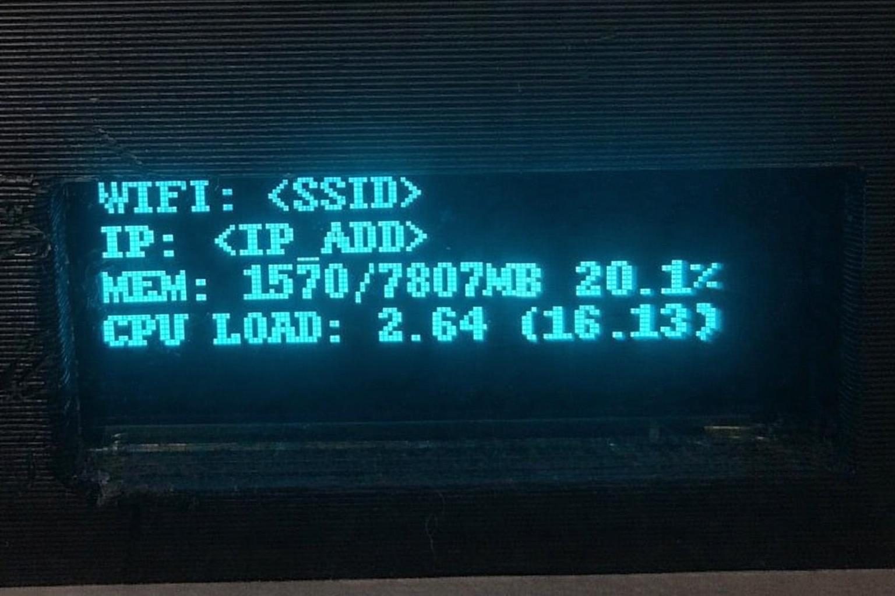
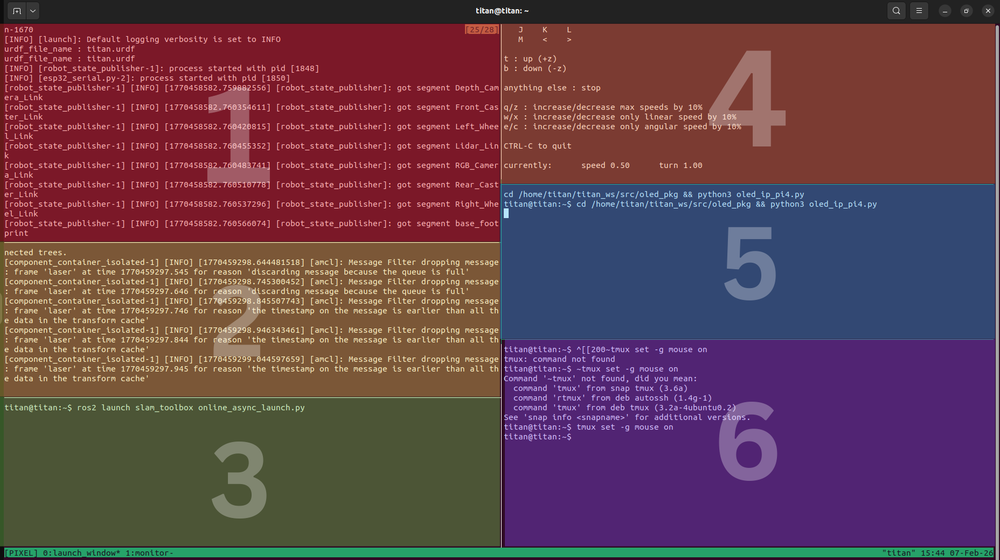

# Pixel Robot Startup & Runtime Overview

## Overview

Pixel is shipped with a **default robot bringup service** that runs automatically when the robot is powered ON.

No manual commands are required to start the robot software.

Once powered on, Pixel:
- Boots the operating system
- Starts the robot bringup service
- Launches navigation by default
- Becomes ready for user interaction over ROS 2

> The robot is fully operational immediately after boot.

---

## On-Boot System Monitor (OLED Display)

When the robot powers on and the bringup sequence starts, the **OLED display turns ON automatically**.

The OLED acts as a real-time system monitor and displays essential runtime information:

- **WiFi SSID** – Network the robot is connected to  
- **IP Address** – Robot’s local IP (for SSH, ROS 2 communication)
- **Memory Usage** – Used vs total system RAM  
- **CPU Load** – Current system load  

This allows quick verification that:
- The robot is connected to WiFi
- Networking is functional
- The system is operating within safe limits

> The OLED monitor starts automatically at boot and requires no manual command.

---

## Default Robot Bringup Service

Pixel includes a **preconfigured robot bringup service** that activates automatically at power-on.

### What the Bringup Service Does

When the robot is powered ON by the user:

- A system-level service starts automatically
- Core robot software is launched
- Navigation is brought up by default
- All required ROS 2 nodes are started in a controlled runtime environment

The user does **not** need to manually launch any software after boot.


Although the bringup service starts automatically, advanced users may want to manually control it.

### Start the Bringup Service

```bash
sudo systemctl start robot_bringup.service
```

### Stop the Bringup Service
```bash
sudo systemctl stop robot_bringup.service
```

### Check status of Robot Service
```bash
sudo systemctl status robot_bringup.service
```
---

## ROS 2 Networking & User Interaction

Pixel runs on **ROS 2 Humble**.

Once the robot has completed startup:

- Any user system running **ROS 2 Humble**
- With the **same `ROS_DOMAIN_ID`**
- On the **same network**

can immediately connect to the robot.

### Typical User Workflow

From the user’s system:
- Open **RViz**
- Connect to the robot
- Send navigation goals
- Monitor robot state and feedback

No additional configuration is required on the robot side.

---

## Runtime Management (tmux-based)

The Pixel robot bringup service is **tmux-based internally**.

This detail is provided for transparency and advanced usage.

- The bringup service launches all robot software inside a tmux session
- This allows safe persistence, observability, and recovery
- Users are **not required to know tmux** for normal operation

> Additional technical details about the tmux-based architecture can be found in the relevant documentation pages.

---

## Attaching to the Running Robot Software

If a user needs to **inspect, stop, or modify** running robot software **without rebooting**, they can attach to the existing runtime session.

Once the robot starts, a **tmux session named `PIXEL` is already running automatically**.

This session organizes all critical robot processes into structured panes so you don’t have to manually launch everything.

**Attach to this tmux session by entering the following command :** 
```bash 
tmux attach-session -t PIXEL
```

To know more about Tmux and the service that is launching it as robot powers on, please refer to the additional information page of this documentation. 

---

## TMUX Session Layout

The `PIXEL` session is divided into multiple panes with the following responsibilities:



**1st Pane (Red)**

``` bash 
ros2 launch titan_bringup titan_bringup.launch.py
```

This launches:
- Robot description (URDF)
- State publisher
- ESP32 serial communication
- Sensors (LIDAR, encoders, etc.)
- Core TF tree

**2nd Pane (yellow)**

```bash 
ros2 launch nav2_bringup bringup_launch.py map:=/home/titan/titan_ws/src/titan_bringup/map/map2.yaml
```

This runs **Nav2 in localization mode** using a prebuilt map.

**3rd Pane (green)**

This pane is reserved for **SLAM Toolbox**.

If you want to **generate a new map**:

1. Stop the Nav2 bringup (localization)
2. Run SLAM Toolbox:

ros2 launch slam_toolbox online_async_launch.py

3. Drive the robot and build a new map

**4th Pane (orange)**

```bash 
ros2 run teleop_twist_keyboard teleop_twist_keyboard
```

Used to manually move the robot with the keyboard.

**5th Pane (blue)**

```bash 
ros2 run oled_pkg oled_ip_pi4.py
```

This node updates the OLED with WiFi, IP, memory, and CPU stats.

**6th Pane (purple)**

- Empty pane reserved for:
  - Debugging commands
  - ROS topic inspection
  - Launching extra nodes

---


